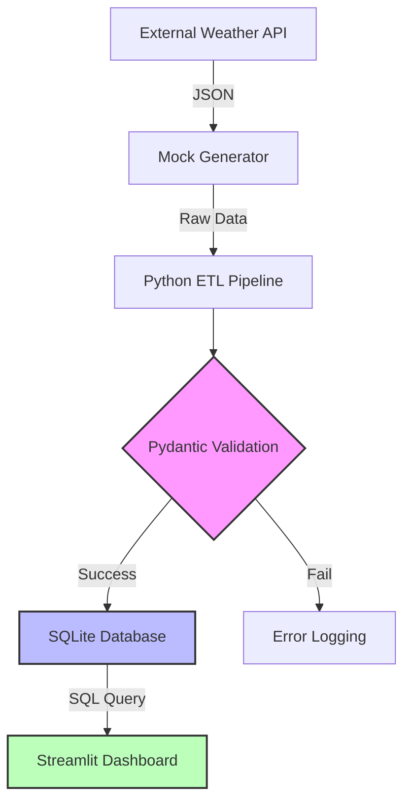

# 🌦️ Real-Time Weather Data Platform

## The "So What?" (Business Value)
Supply chain and logistics teams lose millions annually due to unpredicted extreme weather events. This platform ingests real-time telemetry from external meteorological APIs, validates the data to prevent silent downstream reporting failures, and visualizes it in an auto-updating dashboard. This allows operational teams to reroute shipments proactively based on live weather fronts.

## Setup Instructions
1. **Clone & Virtual Env**: `python -m venv venv && source venv/bin/activate`
2. **Install Dependencies**: `pip install -r requirements.txt`
3. **Generate Synthetic Data**: `python scripts/generate_mock_data.py`
4. **Run ETL Pipeline**: `python src/etl_pipeline.py`
5. **Start Dashboard**: `streamlit run app/dashboard.py`
6. **Docker (Alternative)**: `docker build -t weather-app . && docker run -p 8501:8501 weather-app`

## Senior Reflection: Technical Debt & Future Scaling
**Current Limitations:** * SQLite is used for portability but locks under high concurrent writes.
* Cron/Manual execution lacks dependency management and retry logic.
**The Scale-Up Plan:**
* **Orchestration**: Migrate from standard Python execution to **Apache Airflow** or **Prefect** to handle retries and SLA monitoring.
* **Storage**: Swap SQLite for a managed **PostgreSQL** instance.
* **Compute**: Containerize the ETL and Dashboard separately, deploying via **Kubernetes (EKS/GKE)** to allow the web app to scale independently of the ingestion pipeline.
